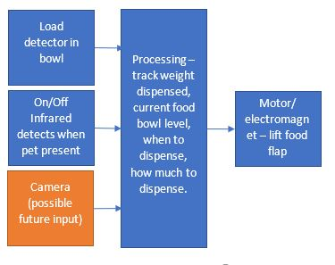

<h1>Feed-a-Bowl</h1>

The innovative product with sales potential and clever appication of sensors. 

Webpage: https://bda164.wixsite.com/feedabowl/ 

For additional martketing, also see the flyer.pdf made which is in marketing stuff for additional compelling marketing 

Aim:
  * Dispense food from a food container when the pet is nearby waiting for food at certain times of the day. 		

Capabilities: 
  * Can sense when pet is in area.
  * Can dispense correct amount of food and not overflow bowl.
  * Can notify owner when food stock running low.
  * Can be programmable for food volume depending on pet size and period of time in which pet should be fed in order to prevent over feeding. 

Further future requirements:
  * Could send a picture of pet feeding to owner. 

Sensors Used:
  * Infrared sensor for when pet is near bowl. 
  * Load sensor for weight of pet bowl. 

Future I/O devices to be used  
  * Either motor to lift a flap to dispense food or an electromagnet. 
  * Possible camera to take picture of pet.

<h3>System Diagram</h3>

